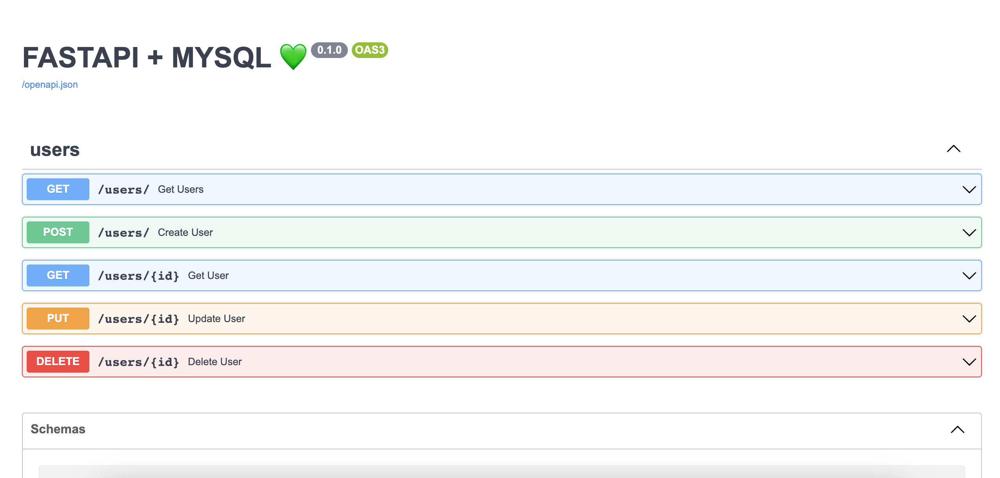

### ⚡️🐬 FastAPI CRUD MySQL
A simple backend app made with python, using fastapi, mysql and SQLAlchemy.


### 🚀 Development
```
uvicorn main:app --reload
```

### 📄 Docs
For accesing to the API docs, look at the following route:
```
http://0.0.0.0:8000/docs
or
http://0.0.0.0:8000/redoc
```

### 💾 Database
Create an `.env` file following `.env.example` file and then run:
```
docker-compose up -d
```

### ⚒️ Technologies
- FastAPI
- MySQL
- Docker
- SQLalchemy
